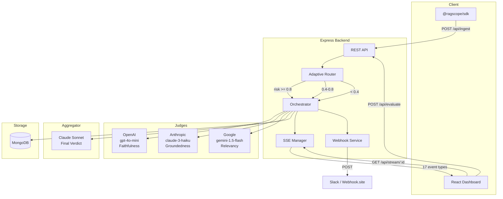
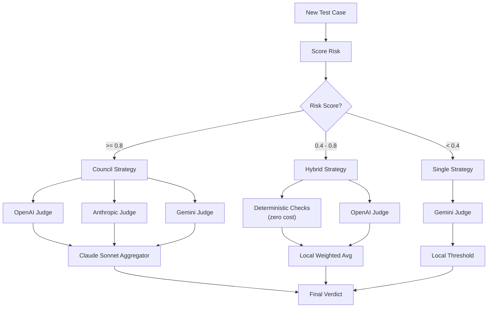
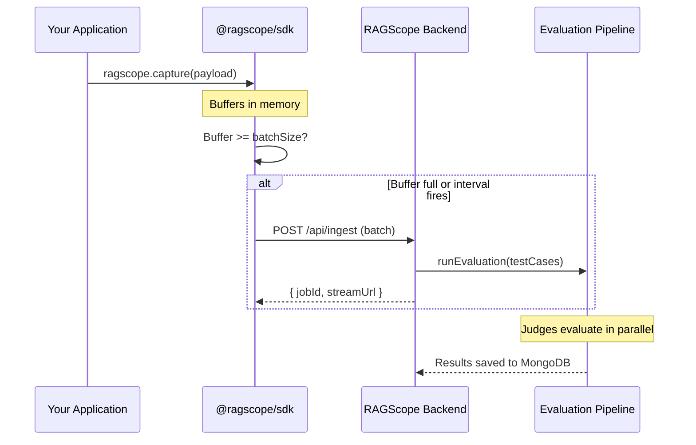

# Architecture

## System Overview

## Adaptive Orchestration Flow

## SDK Data Flow

## SSE Event Protocol

| Event | Direction | Data | When |
|-------|-----------|------|------|
| `connected` | Server → Client | `{ jobId, status }` | On SSE connection |
| `evaluation_start` | Server → Client | `{ jobId, totalTestCases, strategy }` | Evaluation begins |
| `test_case_start` | Server → Client | `{ testCaseIndex, total }` | Each test case begins |
| `risk_scored` | Server → Client | `{ riskScore, riskFactors, selectedStrategy }` | After risk analysis |
| `strategy_selected` | Server → Client | `{ strategy, activeJudges }` | Strategy chosen |
| `deterministic_start` | Server → Client | `{ testCaseIndex }` | Heuristic checks begin |
| `deterministic_complete` | Server → Client | `{ results, avgScore }` | Heuristic checks done |
| `judge_start` | Server → Client | `{ judge, metric }` | Judge begins evaluating |
| `judge_complete` | Server → Client | `{ judge, result }` | Judge returns result |
| `judge_error` | Server → Client | `{ judge, error }` | Judge failed |
| `aggregator_start` | Server → Client | `{ judgeCount }` | Aggregation begins |
| `aggregator_complete` | Server → Client | `{ result }` | Final verdict ready |
| `aggregator_error` | Server → Client | `{ error }` | Aggregation failed |
| `test_case_complete` | Server → Client | `{ testCaseIndex }` | Test case done |
| `evaluation_complete` | Server → Client | `{ summary }` | All test cases done |
| `evaluation_error` | Server → Client | `{ error }` | Fatal error |
| `replay_complete` | Server → Client | `{ status }` | Late-connect replay done |

## Cost Model

| Strategy | Components | Approximate Cost per Test Case |
|----------|-----------|-------------------------------|
| Council | 3 judges + Sonnet aggregator | ~$0.0035 |
| Hybrid | Deterministic (free) + 1 judge | ~$0.0008 |
| Single | 1 judge only | ~$0.0003 |

Cost savings with adaptive routing: **60-80%** for workloads with mixed risk levels.
